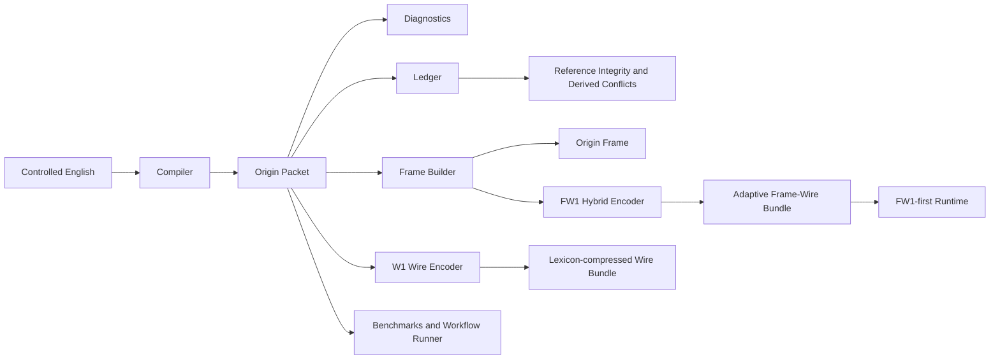
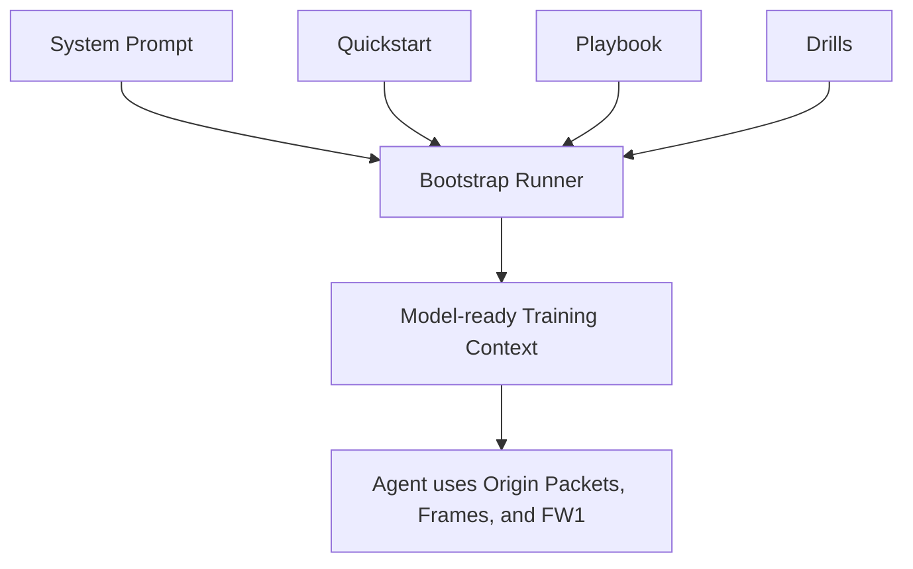
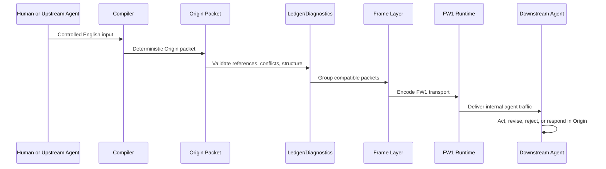

# Origin Language Prototype

Origin is a machine-native attribution language prototype for agent-to-agent communication.

The project explores a simple thesis:

> If AI systems must exchange verifiable state, provenance, confidence, and workflow references, then English is not the optimal transport format.

Origin replaces prose-heavy coordination with compact, structured packets, adaptive bundles, and runtime transport that are easier for AI systems to parse, validate, compress, and reuse.

It now includes readable packets, shared-header frames, a wire bundle, a hybrid frame-wire layer, and an FW1-first runtime path, so Origin is no longer only a readable protocol surface. It has started to evolve toward an internal AI transport language.

## Table of Contents

- [Project Summary](#project-summary)
- [Current Status](#current-status)
- [Project Highlights](#project-highlights)
- [Technical Architecture](#technical-architecture)
- [Core Modules](#core-modules)
- [Repository Structure](#repository-structure)
- [Installation](#installation)
- [Quick Start](#quick-start)
- [Usage](#usage)
- [Configuration](#configuration)
- [Project Progress](#project-progress)
- [Docs Index](#docs-index)
- [FAQ](#faq)

## Project Summary

Origin is not trying to be a human-like natural language.

It is a compact language system for machine coordination with six practical layers:

1. `Language layer`
   A packet syntax for claims, evidence, confidence, intent, references, conflicts, and context.

2. `Protocol layer`
   A framing model for repeated traffic and a ledger model for reference integrity and conflict detection.

3. `Input layer`
   A controlled-English compiler that turns constrained natural-language input into valid Origin packets.

4. `Training layer`
   An AI onboarding pack plus a bootstrap runner that assembles model-ready training context.

5. `Transport layer`
   Machine-oriented `W1` and adaptive `FW1` bundles for internal AI workflow transport.

6. `Runtime layer`
   An FW1-first agent runtime where English stays at the edge and internal coordination defaults to Origin transport.

The current repository is an MVP foundation, not a production network or a full autonomous agent platform.

## Current Status

Current stage: `MVP foundation complete`

The repository currently includes:

- a typed Origin packet model
- a deterministic packet codec
- session-level frame compression
- diagnostics for packet quality
- a ledger for references and derived conflicts
- a controlled-English compiler
- an AI onboarding pack for teaching Origin to other agents
- a bootstrap runner for assembling model-ready training context
- a compiler evaluation suite
- a machine-native `W1` wire format with dynamic lexicon compression
- an adaptive `FW1` hybrid format that combines frame sharing with machine-native transport rules
- a larger workflow corpus that exercises non-empty `FW1` lexicons
- an FW1-first runtime prototype for internal agent coordination

Current verified results from the bundled scripts:

- `npm run bench`
  Sample packet compression gain over English: `49.2%`

- `npm run mvp`
  Bundled workflow packet-level savings over English: `44.8%`
  Bundled workflow frame-level savings over English: `66.0%`
  Bundled workflow frame-vs-packet savings: `38.4%`

- `npm run eval:compiler`
  Compiler evaluation status: `18/18 passed`

- `npm run wire:bench`
  Bundled workflow `W1` savings over English: `53.9%`
  Bundled workflow `W1` savings over `O1`: `16.5%`

- `npm run fw:bench`
  Bundled workflow `FW1` savings over English: `66.1%`
  Bundled workflow `FW1` savings over `W1`: `26.4%`
  Bundled workflow `FW1` savings over `F1`: `0.2%`

- `npm run corpus:bench`
  Large repeated corpus `FW1` savings over English: `61.1%`
  Large repeated corpus `FW1` savings over `F1`: `11.2%`
  Large repeated corpus `FW1` savings over `W1`: `14.8%`
  Large repeated corpus `FW1` lexicon mode: `lexicon`

- `npm run runtime:demo`
  Internal runtime transport `FW1` savings over English: `38.0%`
  Runtime transport mode: `FW1`

This project currently has no external service dependency and no environment variable requirement.

## Project Highlights

### 1. Machine-native message structure

Origin packets separate:

- packet identity
- speaking agent
- claims
- evidence
- confidence
- intent
- response links
- dependency links
- conflict links
- context scope

### 2. Compression beyond prose

Origin improves efficiency through:

- fixed semantic slots
- short opcode dictionaries
- symbolic relations such as `=`, `!=`, `>=`, and `->`
- bundled claims
- shared-header framing
- deterministic normalization
- dynamic lexicon compression in `W1`
- adaptive frame-plus-wire transport in `FW1`

### 3. Workflow continuity

Packets can reference earlier packets through:

- `respondsTo`
- `dependsOn`
- `conflicts`

This makes Origin better suited than plain English for revision, rejection, and multi-step coordination.

### 4. Deterministic input path

The repository does not stop at protocol design. It includes a compiler that turns controlled English into valid Origin packets with explicit defaults and evaluation coverage.

### 5. AI onboarding support

The repository includes:

- quickstart material
- a usage playbook
- drills with target outputs
- a reusable system prompt
- a bootstrap runner that assembles those materials into a single model-ready context bundle

### 6. Runtime proof path

The repository now includes an FW1-first runtime prototype where:

- human ingress enters through controlled English
- internal agent coordination defaults to `FW1`
- final packets can still be rendered back to English at the gateway edge

## Technical Architecture

### Stack

- Language: TypeScript
- Runtime: Node.js ESM
- Runner: `tsx`
- Type checking: `tsc`
- Dependency model: minimal local tooling only

### Architectural Layers

1. `Packet Model Layer`
   Defines the canonical Origin message schema.

2. `Codec Layer`
   Encodes and decodes packets and normalizes packet fields.

3. `Diagnostics Layer`
   Detects weak or machine-unfriendly packet patterns.

4. `Frame Layer`
   Compresses repeated traffic by lifting shared fields into a frame header.

5. `Ledger Layer`
   Tracks packet references and derives conflicts from incompatible claims in the same context.

6. `Compiler Layer`
   Converts controlled English into valid Origin packets.

7. `Training Layer`
   Teaches other AI systems how to use Origin through prompts, drills, and bootstrap bundles.

8. `Evaluation Layer`
   Verifies compiler correctness and deterministic behavior against a growing corpus.

9. `Wire Layer`
   Encodes packets into a machine-native bundle with shared lexicon indexes.

10. `Hybrid Transport Layer`
    Encodes frame-aware bundles that automatically decide whether lexicon atoms help or hurt the final transport size.

11. `Runtime Layer`
    Moves compiled ingress packets through deterministic agents and serializes every internal hop through `FW1`.

### Architecture Diagram



### Agent Training Diagram



### End-to-End Workflow



## Core Modules

| Module | Main Files | Purpose |
|---|---|---|
| Packet model | `src/model.ts` | Defines the Origin packet schema. |
| Vocabulary | `src/vocabulary.ts` | Maps kinds and intents to compact codes. |
| Codec | `src/codec.ts` | Encodes, parses, canonicalizes, and validates packets. |
| Diagnostics | `src/diagnostics.ts` | Flags low-quality packet patterns and frame opportunities. |
| Frames | `src/frame.ts` | Builds, parses, and roundtrips shared-header frames. |
| Ledger | `src/ledger.ts` | Validates references and derives conflicts. |
| Rendering | `src/render.ts` | Renders packets back into readable English. |
| Examples | `src/examples.ts` | Provides reusable packet examples. |
| Workflows | `src/workflow.ts`, `src/workflows.ts` | Runs multi-step agent scenarios and calculates savings. |
| Corpus benchmark | `src/corpus-benchmark.ts` | Benchmarks Origin transports across the bundled workflow corpus. |
| Compiler | `src/compiler.ts` | Compiles controlled English into Origin packets. |
| Compiler CLI | `src/compile-cli.ts` | One-shot command-line compiler entrypoint. |
| Compiler demo | `src/compiler-demo.ts` | Demonstrates compile and roundtrip behavior. |
| Compiler evaluation | `src/compiler-eval.ts`, `src/compiler-eval-cases.ts` | Verifies compiler behavior against a test corpus. |
| Bootstrap runner | `src/bootstrap.ts`, `src/bootstrap-cli.ts` | Builds model-ready Origin onboarding bundles. |
| Wire format | `src/wire.ts` | Encodes and decodes machine-native `W1` bundles with dynamic lexicon compression. |
| Wire demos | `src/wire-demo.ts`, `src/wire-benchmark.ts` | Demonstrates and benchmarks the machine-native transport layer. |
| Hybrid format | `src/fw.ts` | Encodes and decodes adaptive `FW1` bundles that combine frame sharing and wire transport. |
| Hybrid demos | `src/fw-demo.ts`, `src/fw-benchmark.ts` | Demonstrates and benchmarks the adaptive frame-wire layer. |
| Runtime | `src/runtime.ts`, `src/runtime-demo.ts` | Runs an FW1-first coordination loop between deterministic agents. |
| MVP runner | `src/mvp.ts` | Runs the end-to-end incident response scenario. |
| Benchmarks | `src/benchmark.ts` | Compares English size against packet Origin. |

## Repository Structure

```text
.
|-- docs/
|   |-- agent-bootstrap.md
|   |-- agent-drills.md
|   |-- agent-playbook.md
|   |-- agent-quickstart.md
|   |-- compiler-evaluation.md
|   |-- fw-format.md
|   |-- input-compiler.md
|   |-- mvp-modules.md
|   |-- release-v0.1.0.md
|   |-- roadmap-v0.1.1.md
|   |-- runtime.md
|   `-- origin-v0.1.md
|-- prompts/
|   `-- origin-agent-system.md
|-- scripts/
|   `-- check-english.ts
|-- src/
|   |-- benchmark.ts
|   |-- bootstrap-cli.ts
|   |-- bootstrap.ts
|   |-- codec.ts
|   |-- compile-cli.ts
|   |-- compiler-demo.ts
|   |-- compiler-eval-cases.ts
|   |-- compiler-eval.ts
|   |-- compiler.ts
|   |-- corpus-benchmark.ts
|   |-- demo.ts
|   |-- diagnostics.ts
|   |-- examples.ts
|   |-- fw-benchmark.ts
|   |-- fw-demo.ts
|   |-- fw.ts
|   |-- frame.ts
|   |-- ledger.ts
|   |-- model.ts
|   |-- mvp.ts
|   |-- render.ts
|   |-- runtime-demo.ts
|   |-- runtime.ts
|   |-- vocabulary.ts
|   |-- wire-benchmark.ts
|   |-- wire-demo.ts
|   |-- wire.ts
|   |-- workflow.ts
|   `-- workflows.ts
|-- .gitignore
|-- package.json
|-- package-lock.json
|-- README.md
`-- tsconfig.json
```

## Installation

### Requirements

- Node.js
- npm

The project is currently tested in a recent Node.js environment and uses only local TypeScript tooling.

### Install from source

```bash
git clone https://github.com/drinkscholson/Origin.git
cd Origin
npm install
```

## Quick Start

Run the basic walkthrough:

```bash
npm run demo
```

Run the core benchmark:

```bash
npm run bench
```

Run the full MVP workflow:

```bash
npm run mvp
```

Compile one controlled-English packet:

```bash
npm run compile -- "Agent self asserts that door is open based on camera 12@14:03 with 91% confidence. Observe next. Context room A."
```

Generate a model-ready agent bootstrap bundle:

```bash
npm run bootstrap:agent -- --token-budget 1200
```

Run compiler regression tests:

```bash
npm run eval:compiler
```

Run the machine-native wire demo:

```bash
npm run wire:demo
```

Benchmark the wire layer:

```bash
npm run wire:bench
```

Show the hybrid frame-wire layer:

```bash
npm run fw:demo
```

Benchmark the hybrid layer:

```bash
npm run fw:bench
```

Benchmark the larger workflow corpus:

```bash
npm run corpus:bench
```

Run the FW1-first runtime demo:

```bash
npm run runtime:demo
```

## Usage

### Command Reference

| Command | Purpose |
|---|---|
| `npm run demo` | Show packet encoding and decoding examples. |
| `npm run bench` | Measure packet-level savings over English examples. |
| `npm run mvp` | Run the bundled incident-response workflow and frame analysis. |
| `npm run compile -- "<text>"` | Compile one controlled-English input into a packet. |
| `npm run compile:demo` | Show compiler roundtrip and inference examples. |
| `npm run bootstrap:agent` | Build a model-ready training bundle from prompts and drills. |
| `npm run eval:compiler` | Run the compiler evaluation suite. |
| `npm run wire:demo` | Show the lexicon-compressed `W1` wire bundle. |
| `npm run wire:bench` | Compare English, `O1`, `F1`, and `W1` transport sizes. |
| `npm run fw:demo` | Show the adaptive `FW1` hybrid bundle. |
| `npm run fw:bench` | Compare English, `O1`, `F1`, `W1`, and `FW1` transport sizes. |
| `npm run corpus:bench` | Compare English, `O1`, `F1`, `W1`, and `FW1` across the bundled workflow corpus. |
| `npm run runtime:demo` | Run the FW1-first runtime demo with internal agent coordination. |
| `npm run check` | Run TypeScript type checking. |
| `npm run check:english` | Fail if repository text files contain CJK characters. |

### Example Packet

English:

```text
Packet hx21-p5 from agent peer7 commits that medic routes to roomA based on text 88 and voice 44 with 86% confidence. Assist next. Responds to hx21-p4. Depends on hx21-p3. Context incident HX21, priority high, room A.
```

Origin:

```text
O1 $hx21-p5 @peer7 &hx21-p4 +hx21-p3 !c medic->roomA ^text:88 ^voice:44 %86 ~ast #incident=HX21 #priority=high #room=A
```

### Example Frame

```text
F1 @peer7 ^text:88 ^voice:44 #incident=HX21 #priority=high #room=A
- $hx21-p4 !a user=distress %83 ~ntf
- $hx21-p5 &hx21-p4 +hx21-p3 !c medic->roomA %86 ~ast
- $hx21-p6 &hx21-p5 !a corridor=blocked %61 ~vrf
- $hx21-p7 &hx21-p5 +hx21-p6 !r medic->serviceEntry %78 ~ast
END
```

### Example W1 Bundle

```text
W1|A,cam,room,door,open
pkt-001|self|a|~3=~4|~1!12@14:03|91|obs|-|-|-|~2=~0
```

### Example FW1 Bundle

```text
FW1
= @peer7 ^text!88 ^voice!44 #incident=HX21 #priority=high #room=A
- $hx21-p4 !a user=distress %83 ~ntf
- $hx21-p5 &hx21-p4 +hx21-p3 !c medic->roomA %86 ~ast
- $hx21-p6 &hx21-p5 !a corridor=blocked %61 ~vrf
- $hx21-p7 &hx21-p5 +hx21-p6 !r medic->serviceEntry %78 ~ast
.
```

### Programmatic Usage

Compile controlled English in code:

```ts
import { compileEnglishPacket } from "./src/compiler.js";
import { encodePacket } from "./src/codec.js";

const result = compileEnglishPacket(
  "Agent self asserts that door is open based on camera 12@14:03 with 91% confidence. Observe next. Context room A.",
);

console.log(result.packet);
console.log(encodePacket(result.packet));
console.log(result.assumptions);
```

Build a bootstrap bundle in code:

```ts
import { buildAgentBootstrapBundle } from "./src/bootstrap.js";

const bundle = buildAgentBootstrapBundle({
  tokenBudget: 1500,
  drillLimit: 4,
});

console.log(bundle.estimatedTokens);
console.log(bundle.content);
```

Run the FW1-first runtime in code:

```ts
import { runDefaultRuntimeSession } from "./src/runtime.js";

const session = runDefaultRuntimeSession();

console.log(session.transportMode);
console.log(session.totalFrameWireBytes);
console.log(session.finalPackets);
```

## Configuration

### Environment Variables

There are currently no required environment variables.

### Compiler Options

The compiler supports the following API-level options:

- `defaultContext`
- `defaultEvidence`
- `defaultConfidence`
- `defaultIntentByKind`
- `idPrefix`

These options are exposed through `compileEnglishPacket(input, options)`.

### Bootstrap Runner Options

The bootstrap runner supports:

- `--drills <n>`
  Limit the number of included drills.

- `--token-budget <n>`
  Approximate the final context size and automatically trim lower-priority sections until the bundle fits.

- `--out <path>`
  Write the generated bootstrap bundle to disk.

- `--no-quickstart`
  Omit the quickstart section.

- `--no-playbook`
  Omit the playbook section.

- `--no-drills`
  Omit all drills.

### FW1 Options

The `FW1` encoder supports:

- automatic lexicon tuning by default
- an optional `minFrequency` override through `encodeFrameWireBundle(packets, { minFrequency })`

If no lexicon improves the final size, the encoder will emit a `FW1` bundle with an empty lexicon.

### Runtime Options

The runtime entrypoint supports:

- `runDefaultRuntimeSession(input?, { maxRounds })`
- `runOriginRuntimeSession(input, agents, { maxRounds })`

The built-in runtime always uses `FW1` for internal transport envelopes.

### English-only Repository Rule

Repository code, comments, prompts, and docs are intended to remain English-only.

Use:

```bash
npm run check:english
```

to verify that constraint.

## Project Progress

### Completed

- [x] Packet schema and vocabulary
- [x] Packet codec and validation
- [x] Packet normalization
- [x] Diagnostics for packet quality
- [x] Frame encoding and roundtrip parsing
- [x] Reference ledger and derived conflict detection
- [x] MVP workflow runner
- [x] Controlled-English compiler
- [x] Compiler CLI and demo
- [x] AI onboarding documents
- [x] Agent bootstrap runner
- [x] Compiler evaluation corpus
- [x] English-only repository guard
- [x] `W1` machine-native wire layer
- [x] `FW1` adaptive hybrid transport layer
- [x] Larger repeated workflow corpus
- [x] FW1-first runtime prototype

### In Progress

- [ ] Token-budget estimation based on a model-specific tokenizer instead of character approximation
- [ ] Wider controlled-English coverage
- [ ] Larger evaluation corpus
- [ ] Richer conflict graph semantics
- [ ] Richer runtime agent behaviors beyond the deterministic playbook

### Planned

- [ ] Binary transport format
- [ ] Model-in-the-loop Origin generation evaluation
- [ ] Multi-agent runtime integration with model-driven agents
- [ ] Free-form natural-language fallback strategies
- [ ] Model-side preference for `W1` or other non-English internal forms

## Docs Index

- [docs/origin-v0.1.md](./docs/origin-v0.1.md)
  Core language specification.

- [docs/mvp-modules.md](./docs/mvp-modules.md)
  First-principles explanation of the MVP modules.

- [docs/input-compiler.md](./docs/input-compiler.md)
  Controlled-English compiler behavior and examples.

- [docs/agent-quickstart.md](./docs/agent-quickstart.md)
  First-read guide for AI agents.

- [docs/agent-playbook.md](./docs/agent-playbook.md)
  Operational guidance for using Origin in workflows.

- [docs/agent-drills.md](./docs/agent-drills.md)
  Drill set for training and evaluation.

- [docs/agent-bootstrap.md](./docs/agent-bootstrap.md)
  Bootstrap runner usage.

- [docs/compiler-evaluation.md](./docs/compiler-evaluation.md)
  Compiler evaluation suite documentation.

- [docs/wire-format.md](./docs/wire-format.md)
  Machine-native `W1` wire format documentation.

- [docs/fw-format.md](./docs/fw-format.md)
  Adaptive `FW1` hybrid transport documentation.

- [docs/release-v0.1.0.md](./docs/release-v0.1.0.md)
  Formal release notes for the first public Origin release.

- [docs/roadmap-v0.1.1.md](./docs/roadmap-v0.1.1.md)
  Hardening plan for the next patch release.

- [docs/runtime.md](./docs/runtime.md)
  FW1-first runtime prototype documentation.

- [prompts/origin-agent-system.md](./prompts/origin-agent-system.md)
  Copy-pasteable system prompt for Origin-capable agents.

## FAQ

### Is Origin already a fully new AI language?

Origin is a real new language prototype and protocol designed for AI systems, but it is still in the invented-and-evaluated stage rather than a broadly adopted autonomous machine language ecosystem.

### Why use controlled English instead of arbitrary natural language?

Because deterministic input is more valuable than broad but unreliable interpretation at the MVP stage. Controlled English gives Origin a stable path from human-authored text to valid packets.

### Does Origin replace English?

Origin is designed to replace English inside machine coordination and internal AI workflow paths where compactness, provenance, and reference integrity matter. English remains useful at the human interface for explanation, teaching, and discussion.

### Why are packet ids required?

Because multi-agent workflows need explicit references for replies, revisions, dependencies, and audits. Without packet ids, agents would need to quote or restate prior content, which is slower and less reliable.

### Why use ASCII and symbolic syntax?

Because the current goal is machine efficiency, deterministic parsing, and easy integration with existing toolchains. The MVP is optimizing protocol usefulness before aesthetic or emergent linguistic forms.

### Does Origin have a machine-native layer beyond readable packets?

Yes. `W1` and `FW1` are machine-oriented transport layers in the repository. `W1` adds a lexicon-compressed wire bundle. `FW1` adds frame-aware hybrid transport with adaptive lexicon selection.

### Does Origin already use `FW1` inside a runtime?

Yes. The current runtime prototype compiles controlled English at the ingress edge and then uses `FW1` for every internal transport envelope between agents.

### Why can `FW1` choose an empty lexicon?

Because lexicons are not free. On some workloads, shared frame headers already compress the traffic so well that a lexicon would add more header cost than value. `FW1` automatically picks the smallest transport, including the empty-lexicon case when that wins.

### Is there a binary transport format yet?

Not yet. The current repository focuses on text packets and frames first. Binary transport is on the roadmap.

### Is there a production network or API server in this repository?

No. This repository is currently a language, transport, and runtime prototype. It does not yet provide a distributed network, hosted API, or deployment surface.

### Is there a license?

No license file has been added yet in the current repository state.
