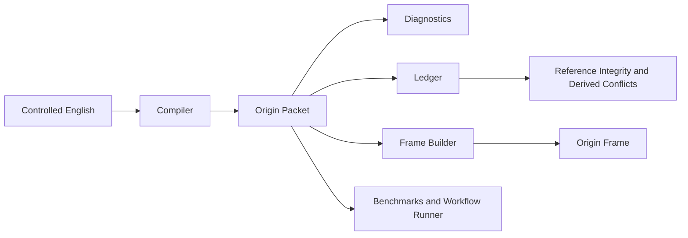
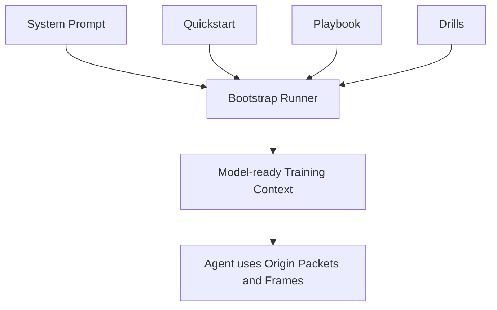
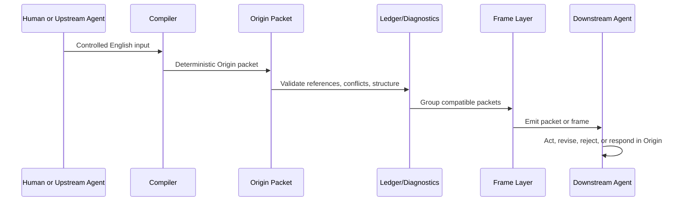

# Origin Language Prototype

Origin is a machine-native attribution language prototype for agent-to-agent communication.

The project explores a simple thesis:

> If AI systems must exchange verifiable state, provenance, confidence, and workflow references, then English is not the optimal transport format.

Origin replaces prose-heavy coordination with compact, structured packets and frames that are easier for machines to parse, validate, compress, and reuse.

## Table of Contents

- [Project Summary](#project-summary)
- [Current Status](#current-status)
- [Project Highlights](#project-highlights)
- [Technical Architecture](#technical-architecture)
- [Core Modules](#core-modules)
- [Repository Structure](#repository-structure)
- [Installation](#installation)
- [Quick Start](#quick-start)
- [Usage](#usage)
- [Configuration](#configuration)
- [Project Progress](#project-progress)
- [Docs Index](#docs-index)
- [FAQ](#faq)

## Project Summary

Origin is not trying to be a human-like natural language.

It is a compact language system for machine coordination with four practical layers:

1. `Language layer`
   A packet syntax for claims, evidence, confidence, intent, references, conflicts, and context.

2. `Protocol layer`
   A framing model for repeated traffic and a ledger model for reference integrity and conflict detection.

3. `Input layer`
   A controlled-English compiler that turns constrained natural-language input into valid Origin packets.

4. `Training layer`
   An AI onboarding pack plus a bootstrap runner that assembles model-ready training context.

The current repository is an MVP foundation, not a production network or a full autonomous multi-agent runtime.

## Current Status

Current stage: `MVP foundation complete`

The repository currently includes:

- a typed Origin packet model
- a deterministic packet codec
- session-level frame compression
- diagnostics for packet quality
- a ledger for references and derived conflicts
- a controlled-English compiler
- an AI onboarding pack for teaching Origin to other agents
- a bootstrap runner for assembling model-ready training context
- a compiler evaluation suite

Current verified results from the bundled scripts:

- `npm run bench`
  Sample packet compression gain over English: `49.2%`

- `npm run mvp`
  Bundled workflow packet-level savings over English: `44.8%`
  Bundled workflow frame-level savings over English: `66.0%`
  Bundled workflow frame-vs-packet savings: `38.4%`

- `npm run eval:compiler`
  Compiler evaluation status: `18/18 passed`

This project currently has no external service dependency and no environment variable requirement.

## Project Highlights

### 1. Machine-native message structure

Origin packets separate:

- packet identity
- speaking agent
- claims
- evidence
- confidence
- intent
- response links
- dependency links
- conflict links
- context scope

### 2. Compression beyond prose

Origin improves efficiency through:

- fixed semantic slots
- short opcode dictionaries
- symbolic relations such as `=`, `!=`, `>=`, and `->`
- bundled claims
- shared-header framing
- deterministic normalization

### 3. Workflow continuity

Packets can reference earlier packets through:

- `respondsTo`
- `dependsOn`
- `conflicts`

This makes Origin better suited than plain English for revision, rejection, and multi-step coordination.

### 4. Deterministic input path

The repository does not stop at protocol design. It includes a compiler that turns controlled English into valid Origin packets with explicit defaults and evaluation coverage.

### 5. AI onboarding support

The repository includes:

- quickstart material
- a usage playbook
- drills with target outputs
- a reusable system prompt
- a bootstrap runner that assembles those materials into a single model-ready context bundle

## Technical Architecture

### Stack

- Language: TypeScript
- Runtime: Node.js ESM
- Runner: `tsx`
- Type checking: `tsc`
- Dependency model: minimal local tooling only

### Architectural Layers

1. `Packet Model Layer`
   Defines the canonical Origin message schema.

2. `Codec Layer`
   Encodes and decodes packets and normalizes packet fields.

3. `Diagnostics Layer`
   Detects weak or machine-unfriendly packet patterns.

4. `Frame Layer`
   Compresses repeated traffic by lifting shared fields into a frame header.

5. `Ledger Layer`
   Tracks packet references and derives conflicts from incompatible claims in the same context.

6. `Compiler Layer`
   Converts controlled English into valid Origin packets.

7. `Training Layer`
   Teaches other AI systems how to use Origin through prompts, drills, and bootstrap bundles.

8. `Evaluation Layer`
   Verifies compiler correctness and deterministic behavior against a growing corpus.

### Architecture Diagram



### Agent Training Diagram



### End-to-End Workflow



## Core Modules

| Module | Main Files | Purpose |
|---|---|---|
| Packet model | `src/model.ts` | Defines the Origin packet schema. |
| Vocabulary | `src/vocabulary.ts` | Maps kinds and intents to compact codes. |
| Codec | `src/codec.ts` | Encodes, parses, canonicalizes, and validates packets. |
| Diagnostics | `src/diagnostics.ts` | Flags low-quality packet patterns and frame opportunities. |
| Frames | `src/frame.ts` | Builds, parses, and roundtrips shared-header frames. |
| Ledger | `src/ledger.ts` | Validates references and derives conflicts. |
| Rendering | `src/render.ts` | Renders packets back into readable English. |
| Examples | `src/examples.ts` | Provides reusable packet examples. |
| Workflows | `src/workflow.ts`, `src/workflows.ts` | Runs multi-step agent scenarios and calculates savings. |
| Compiler | `src/compiler.ts` | Compiles controlled English into Origin packets. |
| Compiler CLI | `src/compile-cli.ts` | One-shot command-line compiler entrypoint. |
| Compiler demo | `src/compiler-demo.ts` | Demonstrates compile and roundtrip behavior. |
| Compiler evaluation | `src/compiler-eval.ts`, `src/compiler-eval-cases.ts` | Verifies compiler behavior against a test corpus. |
| Bootstrap runner | `src/bootstrap.ts`, `src/bootstrap-cli.ts` | Builds model-ready Origin onboarding bundles. |
| MVP runner | `src/mvp.ts` | Runs the end-to-end incident response scenario. |
| Benchmarks | `src/benchmark.ts` | Compares English size against packet Origin. |

## Repository Structure

```text
.
|-- docs/
|   |-- agent-bootstrap.md
|   |-- agent-drills.md
|   |-- agent-playbook.md
|   |-- agent-quickstart.md
|   |-- compiler-evaluation.md
|   |-- input-compiler.md
|   |-- mvp-modules.md
|   `-- origin-v0.1.md
|-- prompts/
|   `-- origin-agent-system.md
|-- scripts/
|   `-- check-english.ts
|-- src/
|   |-- benchmark.ts
|   |-- bootstrap-cli.ts
|   |-- bootstrap.ts
|   |-- codec.ts
|   |-- compile-cli.ts
|   |-- compiler-demo.ts
|   |-- compiler-eval-cases.ts
|   |-- compiler-eval.ts
|   |-- compiler.ts
|   |-- demo.ts
|   |-- diagnostics.ts
|   |-- examples.ts
|   |-- frame.ts
|   |-- ledger.ts
|   |-- model.ts
|   |-- mvp.ts
|   |-- render.ts
|   |-- vocabulary.ts
|   |-- workflow.ts
|   `-- workflows.ts
|-- .gitignore
|-- package.json
|-- package-lock.json
|-- README.md
`-- tsconfig.json
```

## Installation

### Requirements

- Node.js
- npm

The project is currently tested in a recent Node.js environment and uses only local TypeScript tooling.

### Install from source

```bash
git clone https://github.com/drinkscholson/Origin.git
cd Origin
npm install
```

## Quick Start

Run the basic walkthrough:

```bash
npm run demo
```

Run the core benchmark:

```bash
npm run bench
```

Run the full MVP workflow:

```bash
npm run mvp
```

Compile one controlled-English packet:

```bash
npm run compile -- "Agent self asserts that door is open based on camera 12@14:03 with 91% confidence. Observe next. Context room A."
```

Generate a model-ready agent bootstrap bundle:

```bash
npm run bootstrap:agent -- --token-budget 1200
```

Run compiler regression tests:

```bash
npm run eval:compiler
```

## Usage

### Command Reference

| Command | Purpose |
|---|---|
| `npm run demo` | Show packet encoding and decoding examples. |
| `npm run bench` | Measure packet-level savings over English examples. |
| `npm run mvp` | Run the bundled incident-response workflow and frame analysis. |
| `npm run compile -- "<text>"` | Compile one controlled-English input into a packet. |
| `npm run compile:demo` | Show compiler roundtrip and inference examples. |
| `npm run bootstrap:agent` | Build a model-ready training bundle from prompts and drills. |
| `npm run eval:compiler` | Run the compiler evaluation suite. |
| `npm run check` | Run TypeScript type checking. |
| `npm run check:english` | Fail if repository text files contain CJK characters. |

### Example Packet

English:

```text
Packet hx21-p5 from agent peer7 commits that medic routes to roomA based on text 88 and voice 44 with 86% confidence. Assist next. Responds to hx21-p4. Depends on hx21-p3. Context incident HX21, priority high, room A.
```

Origin:

```text
O1 $hx21-p5 @peer7 &hx21-p4 +hx21-p3 !c medic->roomA ^text:88 ^voice:44 %86 ~ast #incident=HX21 #priority=high #room=A
```

### Example Frame

```text
F1 @peer7 ^text:88 ^voice:44 #incident=HX21 #priority=high #room=A
- $hx21-p4 !a user=distress %83 ~ntf
- $hx21-p5 &hx21-p4 +hx21-p3 !c medic->roomA %86 ~ast
- $hx21-p6 &hx21-p5 !a corridor=blocked %61 ~vrf
- $hx21-p7 &hx21-p5 +hx21-p6 !r medic->serviceEntry %78 ~ast
END
```

### Programmatic Usage

Compile controlled English in code:

```ts
import { compileEnglishPacket } from "./src/compiler.js";
import { encodePacket } from "./src/codec.js";

const result = compileEnglishPacket(
  "Agent self asserts that door is open based on camera 12@14:03 with 91% confidence. Observe next. Context room A.",
);

console.log(result.packet);
console.log(encodePacket(result.packet));
console.log(result.assumptions);
```

Build a bootstrap bundle in code:

```ts
import { buildAgentBootstrapBundle } from "./src/bootstrap.js";

const bundle = buildAgentBootstrapBundle({
  tokenBudget: 1500,
  drillLimit: 4,
});

console.log(bundle.estimatedTokens);
console.log(bundle.content);
```

## Configuration

### Environment Variables

There are currently no required environment variables.

### Compiler Options

The compiler supports the following API-level options:

- `defaultContext`
- `defaultEvidence`
- `defaultConfidence`
- `defaultIntentByKind`
- `idPrefix`

These options are exposed through `compileEnglishPacket(input, options)`.

### Bootstrap Runner Options

The bootstrap runner supports:

- `--drills <n>`
  Limit the number of included drills.

- `--token-budget <n>`
  Approximate the final context size and automatically trim lower-priority sections until the bundle fits.

- `--out <path>`
  Write the generated bootstrap bundle to disk.

- `--no-quickstart`
  Omit the quickstart section.

- `--no-playbook`
  Omit the playbook section.

- `--no-drills`
  Omit all drills.

### English-only Repository Rule

Repository code, comments, prompts, and docs are intended to remain English-only.

Use:

```bash
npm run check:english
```

to verify that constraint.

## Project Progress

### Completed

- [x] Packet schema and vocabulary
- [x] Packet codec and validation
- [x] Packet normalization
- [x] Diagnostics for packet quality
- [x] Frame encoding and roundtrip parsing
- [x] Reference ledger and derived conflict detection
- [x] MVP workflow runner
- [x] Controlled-English compiler
- [x] Compiler CLI and demo
- [x] AI onboarding documents
- [x] Agent bootstrap runner
- [x] Compiler evaluation corpus
- [x] English-only repository guard

### In Progress

- [ ] Token-budget estimation based on a model-specific tokenizer instead of character approximation
- [ ] Wider controlled-English coverage
- [ ] Larger evaluation corpus
- [ ] Richer conflict graph semantics

### Planned

- [ ] Binary transport format
- [ ] Model-in-the-loop Origin generation evaluation
- [ ] Multi-agent runtime integration
- [ ] Free-form natural-language fallback strategies

## Docs Index

- [docs/origin-v0.1.md](./docs/origin-v0.1.md)
  Core language specification.

- [docs/mvp-modules.md](./docs/mvp-modules.md)
  First-principles explanation of the MVP modules.

- [docs/input-compiler.md](./docs/input-compiler.md)
  Controlled-English compiler behavior and examples.

- [docs/agent-quickstart.md](./docs/agent-quickstart.md)
  First-read guide for AI agents.

- [docs/agent-playbook.md](./docs/agent-playbook.md)
  Operational guidance for using Origin in workflows.

- [docs/agent-drills.md](./docs/agent-drills.md)
  Drill set for training and evaluation.

- [docs/agent-bootstrap.md](./docs/agent-bootstrap.md)
  Bootstrap runner usage.

- [docs/compiler-evaluation.md](./docs/compiler-evaluation.md)
  Compiler evaluation suite documentation.

- [prompts/origin-agent-system.md](./prompts/origin-agent-system.md)
  Copy-pasteable system prompt for Origin-capable agents.

## FAQ

### Is Origin already a fully new AI language?

Origin is a real new language prototype and protocol designed for AI systems, but it is still in the invented-and-evaluated stage rather than a broadly adopted autonomous machine language ecosystem.

### Why use controlled English instead of arbitrary natural language?

Because deterministic input is more valuable than broad but unreliable interpretation at the MVP stage. Controlled English gives Origin a stable path from human-authored text to valid packets.

### Does Origin replace English?

No. Origin is designed to replace English in machine coordination paths where compactness, provenance, and reference integrity matter. English remains useful for explanation, teaching, and human-facing discussion.

### Why are packet ids required?

Because multi-agent workflows need explicit references for replies, revisions, dependencies, and audits. Without packet ids, agents would need to quote or restate prior content, which is slower and less reliable.

### Why use ASCII and symbolic syntax?

Because the current goal is machine efficiency, deterministic parsing, and easy integration with existing toolchains. The MVP is optimizing protocol usefulness before aesthetic or emergent linguistic forms.

### Is there a binary transport format yet?

Not yet. The current repository focuses on text packets and frames first. Binary transport is on the roadmap.

### Is there a production network or API server in this repository?

No. This repository is currently a language and tooling prototype. It does not yet provide a distributed runtime, hosted API, or deployment surface.

### Is there a license?

No license file has been added yet in the current repository state.
